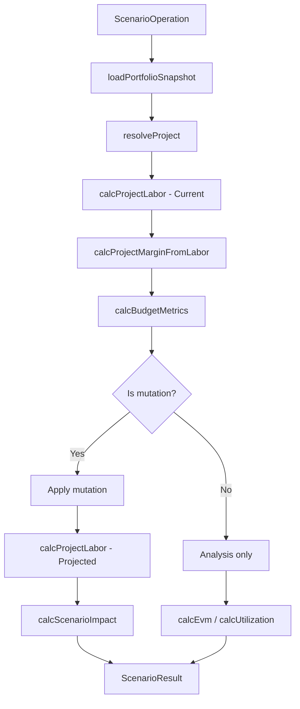

# Executor

`server/engine/executor.ts` is the entry point for running complete scenarios. This is the **engine boundary** that loads data from the database, calls pure calculation functions, and assembles the `ScenarioResult` envelope.

## Functions

### `executeScenario(operation)`

Main entry point. Takes a `ScenarioOperation` and returns a `ScenarioResult`.

```typescript
import { executeScenario } from "./engine/index.js";

const result = await executeScenario({
  action: "swap",
  project: "Alpha",
  remove: [{ role: "Senior Developer", count: 1 }],
  add: [{ role: "Mid-level Developer", count: 2 }]
});
```

**Steps:**
1. Load `PortfolioSnapshot` from database
2. Resolve project by name (fuzzy match)
3. Calculate current metrics (labor → margin → budget)
4. Apply mutation (swap/add/remove/etc.)
5. Calculate projected metrics
6. Compute delta (`ScenarioImpact`)
7. Return `ScenarioResult` envelope

---

### `loadPortfolioSnapshot()`

Load the full database state into a `PortfolioSnapshot`.

```typescript
const snapshot = loadPortfolioSnapshot();
// → { projects: [...], labor_categories: [...] }
```

---

### `resolveProject(name, snapshot)`

Fuzzy-find a project by name from the snapshot.

```typescript
resolveProject("alpha", snapshot);
// → ProjectSnapshot for "Alpha"
```

---

### `resolveRole(role, categories)`

Fuzzy-find a labor category by role name.

```typescript
resolveRole("Sr Dev", categories);
// → LaborCategory for "Senior Developer"
```

## Execution Flow


