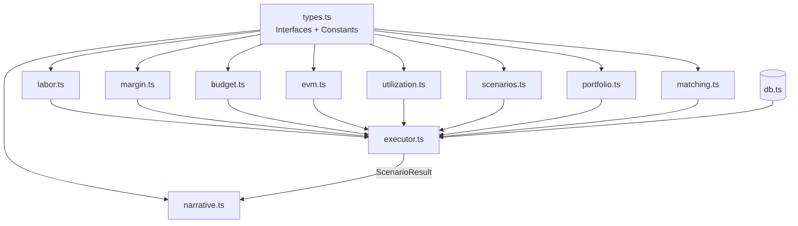

# Calculation Engine

The `server/engine/` directory contains the deterministic financial calculation engine. All modules are **pure functions** — no I/O, no side effects, no LLM calls.

## Architecture



## Design Principles

| Principle | Description |
|-----------|-------------|
| **Pure computation** | Calculation modules take explicit inputs and return explicit outputs |
| **Immutability** | Mutation functions return new arrays; never modify inputs |
| **Safe arithmetic** | `safeDivide()` prevents `Infinity`/`NaN` from propagating |
| **Determinism** | Same inputs always produce the same output |
| **AI separation** | Engine has no knowledge of LLM providers or prompts |

## Module Map

| Module | Purpose | Key export |
|--------|---------|------------|
| [`types.ts`](./types) | Interfaces + constants | All shared types |
| [`labor.ts`](./labor) | Labor cost/revenue | `calcProjectLabor()` |
| [`margin.ts`](./margin) | Profitability | `calcProjectMargin()` |
| [`budget.ts`](./budget) | Burn rate + exhaustion | `calcBudgetMetrics()` |
| [`evm.ts`](./evm) | Earned Value Management | `calcEvm()` |
| [`scenarios.ts`](./scenarios) | Staffing mutations | `applySwap()`, `calcScenarioImpact()` |
| [`portfolio.ts`](./portfolio) | Portfolio aggregation | `calcPortfolioMetrics()` |
| [`matching.ts`](./matching) | Fuzzy role matching | `fuzzyMatch()` |
| [`narrative.ts`](./narrative) | Template narratives | `generateNarrative()` |
| [`executor.ts`](./executor) | Orchestration | `executeScenario()` |

## Tests

98 unit tests across 7 test files covering all modules:

```bash
# Run all engine tests
npx vitest run

# Watch mode
npx vitest
```

| Test file | Covers |
|-----------|--------|
| `labor.test.ts` | `labor.ts` functions |
| `budget.test.ts` | `budget.ts` functions |
| `margin.test.ts` | `margin.ts` functions |
| `evm.test.ts` | `evm.ts` functions |
| `scenarios.test.ts` | `scenarios.ts` mutations + impact |
| `goal-seeking.test.ts` | Goal-seeking / what-if scenarios |
| `narrative.test.ts` | `narrative.ts` output |
