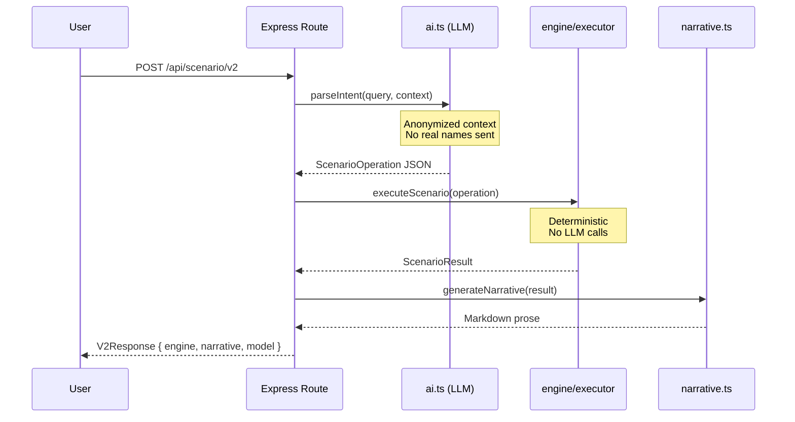
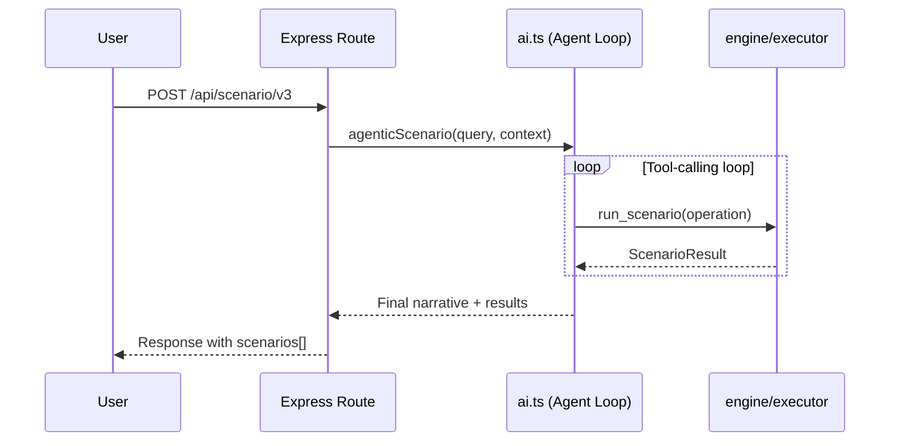

# AI Workflows

The app supports two AI-assisted scenario analysis flows, plus a fully deterministic fallback.

## Scenario Pipeline (V2) {#v2}

The primary scenario path. The LLM parses intent, the deterministic engine computes results, and the app returns a template or LLM-generated narrative.



### Key Guarantees

- **Engine isolation** — `executeScenario()` never calls the LLM
- **Privacy** — Person names replaced with `Staff-N` before any cloud call
- **Determinism** — Same `ScenarioOperation` always produces the same `ScenarioResult`
- **Fallback narrative** — Template-based markdown when LLM narration is disabled

## Agentic Analysis (V3) {#v3}

The V3 flow uses tool-calling to let the LLM explore one or more scenarios using exact engine outputs.



## Parse-Only Mode

For debugging or UX preview, you can parse intent without computing:

::: code-group

```bash [cURL]
curl -X POST http://localhost:3000/api/scenario/v2/parse-only \
  -H "Content-Type: application/json" \
  -d '{"query": "What if we add 2 QA Engineers to Alpha?"}'
```

```typescript [api.ts]
const result = await runScenarioV2(
  "What if we add 2 QA Engineers to Alpha?",
  true // skipNarrative
);
```

:::

Returns the structured `ScenarioOperation` without executing the engine.

## LLM Providers

| Provider | Config key | Notes |
|----------|-----------|-------|
| GitHub Models API | `github` (default) | Requires PAT with `models:read` scope |
| Ollama (local) | `ollama` | No PAT needed; requires running Ollama server |

Switch providers via the **Settings** tab or by editing `llm_provider` in the config table.

### Default Models

| Provider | Default model |
|----------|--------------|
| GitHub | `openai/gpt-4.1` |
| Ollama | `llama3.2` |

## Anonymization

Before sending context to any cloud LLM, `buildAnonymizedContextSnapshot()` in `server/db.ts` strips person names (PII):

```
Real data:        "Jane Smith — Senior Developer on Alpha"
Anonymized:       "Staff-1 — Senior Developer on Alpha"
```

Project names, role names, and financial figures are preserved — only person names are replaced.

::: danger Do Not Modify
The anonymization function is privacy-critical. Do not modify `buildAnonymizedContextSnapshot()` in a way that could leak real names to external APIs.
:::
