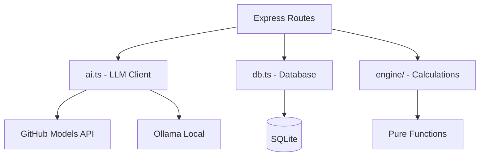
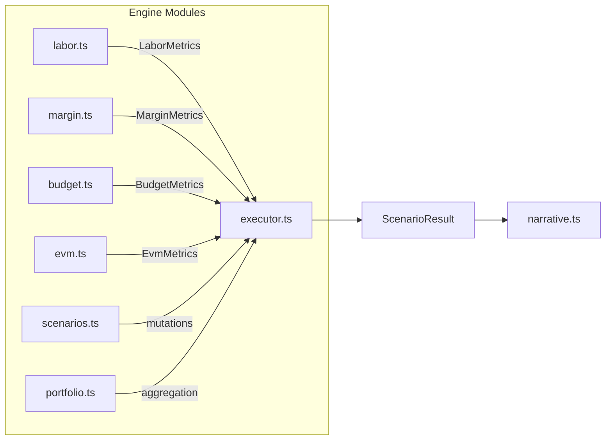

# Architecture

## High-Level Overview

```
┌─────────────────────────────────────────────────┐
│ Browser UI                                      │
│ React 19 + Vite + Tailwind                      │
│ Dashboard │ AI Analyst │ Staffing │ Settings    │
└──────────────────┬──────────────────────────────┘
                   │ REST API
┌──────────────────┴──────────────────────────────┐
│ Express Server                                  │
│  routes.ts   db.ts   ai.ts   import/excel/      │
│                      │                           │
│                      ▼                           │
│             server/engine/                      │
│     deterministic financial calculations        │
└───────────────┬───────────────────────┬─────────┘
                │                       │
                ▼                       ▼
      Local SQLite data           Optional LLM provider
        data/finimpact.db         GitHub Models or Ollama
```

## Key Design Constraint

::: warning CRITICAL SEPARATION
**The calculation engine never calls the LLM.** The LLM only parses intent (input) and optionally narrates results (output). All financial numbers come from the engine.
:::

## Project Structure

```
fin-impact-tool/
├── server/                     Express + TypeScript backend
│   ├── index.ts                Entry point, static file serving
│   ├── db.ts                   SQLite schema, seed data, queries
│   ├── ai.ts                   LLM client (GitHub Models + Ollama)
│   ├── routes.ts               REST API endpoints
│   ├── engine/                 Financial calculation engine
│   │   ├── types.ts            Shared types and constants
│   │   ├── labor.ts            Labor cost/revenue metrics
│   │   ├── margin.ts           Margin and profitability
│   │   ├── budget.ts           Burn rate and budget exhaustion
│   │   ├── evm.ts              Earned Value Management
│   │   ├── utilization.ts      Utilization rate metrics
│   │   ├── scenarios.ts        Staffing mutations
│   │   ├── portfolio.ts        Portfolio-level aggregation
│   │   ├── matching.ts         Fuzzy role-name matching
│   │   ├── narrative.ts        Template-based narrative
│   │   ├── executor.ts         Scenario orchestration
│   │   └── __tests__/          98 unit tests
│   └── import/excel/           Excel workbook import
├── client/                     React + Vite + Tailwind SPA
│   └── src/
│       ├── App.tsx             Tab navigation shell
│       ├── api.ts              Typed fetch client
│       ├── format.ts           Formatting helpers
│       └── components/         Dashboard, Chat, Staffing, Settings
├── tests/e2e/                  Playwright tests
├── data/                       SQLite database
└── start.bat                   Windows launcher
```

## Data Flow

### Server Layers



### Engine Architecture



## Database

All data lives in a single SQLite file (`data/finimpact.db`).

- **Auto-initialized** on first run via `initSchema()` in `server/db.ts`
- **WAL journal mode** enabled for concurrent read safety
- **Synchronous API** via `better-sqlite3` — no async/await needed

### Tables

| Table | Purpose |
|-------|---------|
| `projects` | Project budgets, dates, status |
| `labor_categories` | Bill/cost rate card |
| `staffing` | Per-person assignments (project × role × hours) |
| `scenarios` | Query history log |
| `config` | App configuration (LLM provider, PAT, model) |
